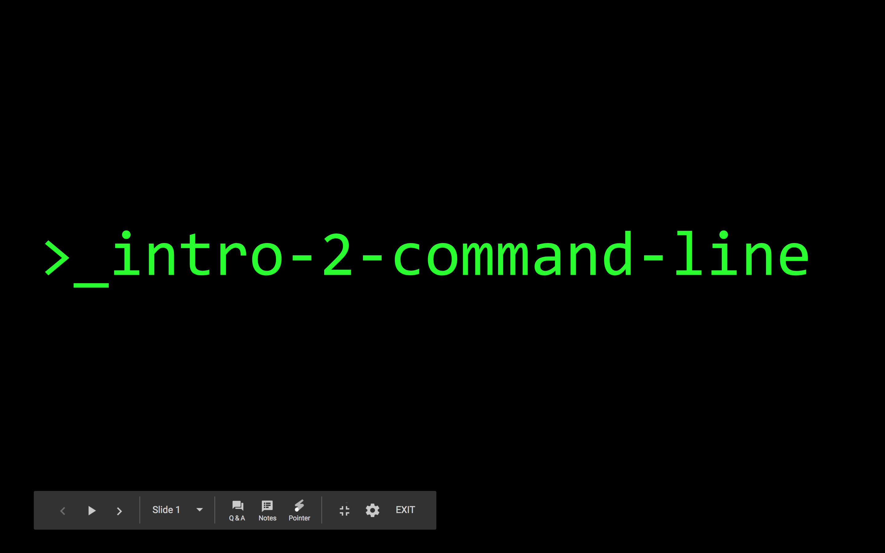

# Othernet CLI-Bootcamp

This is the curriculum for basic networking/command line.  This is used for our Othernet Workshops to teach teenagers the basics of working with a computer. This repo contains exersizes and shell scripts.  

## Before Workshop: 
- Make sure there is a computer on the network ( or a remote server ) that each student can ssh into with their own usernames.  
- eg: ssh dhruv@ip_address should drop student into -> /home/dhruv 
- eg: ssh edwin@ip_address should drop user into -> /home/edwin 
- This will be their personal working space. Not doing this locally will allow the instructor ( as root ) to look to share what each student builds throughout the class.

- Make sure windows users have an ssh client. 
- Make sure tree command is installed on pi
- Make sure nmap is installed
- Run setup.sh to populate directories with teaching material. and set up user accounts.  

